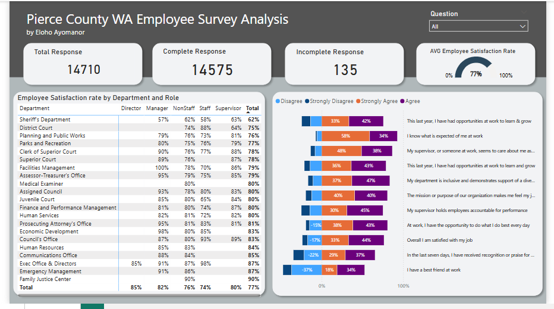
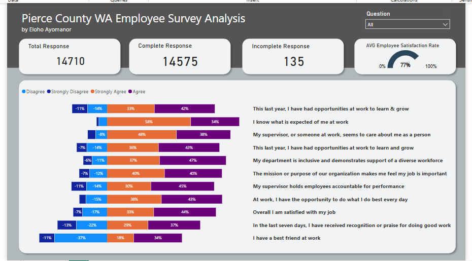
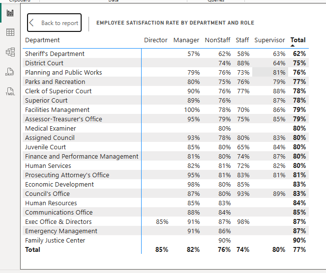

# Pierce County Employee Survey
## Introduction

This repository contains an analysis of employee satisfaction data collected from Pierce County, WA. The project is to derive insights to answer specific questions and help Pierce County make data driven decisions. The insights were derived using Power BI.

**_Disclaimer_** : _All datasets and reports do not represent any company, institution or country, but just a dummy dataset to demonstrate the capabilities of Power BI_

---

## Survey Overview

-  **Total Responses:**  14,710
-  **Completed Response:**  14,575
-  **Incomplete Response:**  135
-  **Average Satisfaction Rate:**  77%

---

## Visual Analysis

## Question 1: Which Question did respondents agree/disagree with most?

-**Most Agreed:**

  -  **"I know what is expected of me at work"**
     -  **Strongly Agree**  58%
     -  **Agree**  34%
     -  **Total Agreement**  92%

  -  **"My supervisor, or someone at work, seems to care about me as a person"**
     -  **Strongly Agree**  48%
     -  **Agree**  38%
     -  **Total Agreement**  86%

       
-**Most Disagreed:**

  -  **"I have a best friend at work"**
     -  **Strongly Disagree**  11%
     -  **Disagree**  37%
     -  **Total Disagreement**  48%

  -  **"In the last seven days, I have recieved recognition or praise for doing good work"**
     -  **Strongly Disagree**  13%
     -  **Disagree**  22%
     -  **Total Disagreement**  35%
  -  These results suggest that while clarity of role and supportive supervisors are strong points, social bonding and timely recognition are lacking.
   
---

### Question 2: Any Patterns by department or role?

- **Highest Satisfaction by Department**:
  - **Family Justice Centre** 90%
  - **Emergency Management** 87%
  - **Executive Office** 87%
- **Lowest Satisfaction by Department**:
  - **Sheriff's Department** 62%
- **Highest Satisfaction by Role**:
  - **Directors** 85%
  - **Managers** 82%
- **Lowest Satisfaction by Role**:
  - Staff (74%) and Non-Staff (76%)
- This shows that satisfaction generally increases with hierarchy. Front-line and support staff tend to be less satisfied.

---

## Conclusion and Recomendations
The employee survey provides valuable insights. Employees understand their roles and feel supported by supervisors, but lack personal connections at work and feel under-recognized. To elevate satisfaction from the current 77% average, employers should focus on human connection, appreciation, and targeted support in lower-performing departments and roles.

## Author
**Eloho Ayomanor**
Data Analyst | BI Enthusiast
[www.linkedin.com/in/eloho-ayomanor]

       
